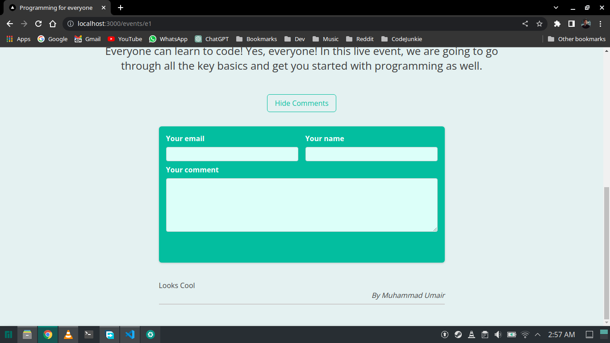

## Concepts used/learnt in this module

```
1. Api routes in Next.js
2. Structuring the routes
3. Sending requests to those routes
4. Connecting & Using MongoDB in Next.js
5. Creating helper functions for MongoDB
6. Error handling
```

## Dotenv

```
MONGODB_URI:string
```

## Screenshots





