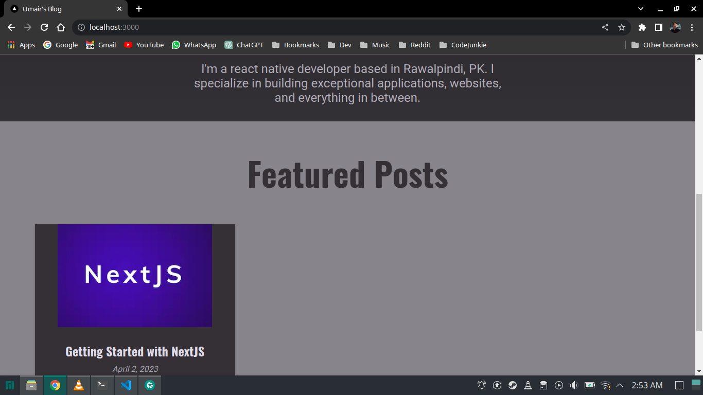

## Concepts used/learnt in this module

```
1. Api routes in Next.js
2. Structuring the routes
3. Sending requests to those routes
4. Connecting & Using MongoDB in Next.js
5. Creating helper functions for MongoDB
6. Error handling
7. React Portals
8. Show Notifications
9. Head Component in Next.js
10. Markdown files for storing posts
11. Use gray-matter to parse the markdown files
12. Use react-markdown to render the markdown files
13. Use the custom elements to render the markdown files
14. Use Image Component from next/image to render images
15. Use react-syntax-highlighter to render code blocks
16. Use atom-dark theme for code blocks
17. Use NextConfig to add env variables
19. Optimizing code for production
20. Use PrismLight to render code blocks
```

## Dotenv

```
MONGODB_URI:string
```

## Deployed on Vercel

[Click Here](https://nextjs-udemy-blond.vercel.app/)

## Screenshots





